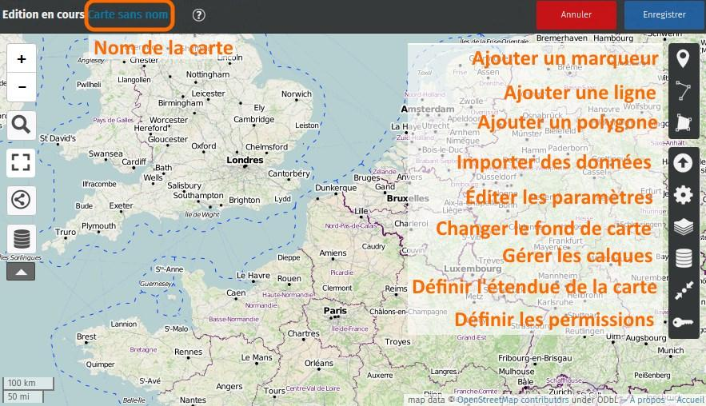
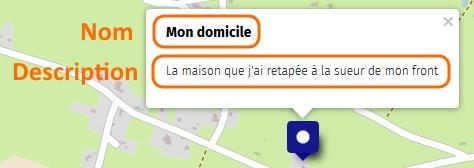

!!! abstract "Ce que nous allons apprendre"

    -   distinguer le mode édition du mode consultation
    -   identifier les étapes nécessaires pour créer une carte
    -   produire une première carte et la diffuser !

## Procédons par étapes

L’objet de notre première carte est simple : positionner un ou plusieurs
lieux (domicile, vacances, travail, etc.). Procédons par étapes.

### 1. Le mode édition

#### Pour le grand public, les associations…

Rendez-vous sur l’instance uMap d’OSM <https://umap.openstreetmap.fr/>

#### Pour les agents publics

Rendez-vous sur le site uMap agents publics <https://umap.incubateur.anct.gouv.fr/>
et connectez-vous en haut à gauche. La connexion utilise MonComptePro.

<shot-scraper
    data-output="static/tutoriels/create-map.png"
    data-url="https://umap.openstreetmap.fr/fr/"
    data-alt="Bouton de création d’une carte depuis l’accueil."
    data-width="176"
    data-height="119"
    data-selector=".button.button-primary"
    data-padding="5"
    >Bouton de création d’une carte depuis l’accueil.</shot-scraper>

Apparaît alors sur votre navigateur une carte qui se présente ainsi :

Nous retrouvons à gauche les boutons disponibles lors de la
[consultation d’une carte](1-browsing-a-map.md).

Plusieurs éléments visibles au-dessus et à droite de la carte sont
visibles uniquement lorsque l’on crée ou modifie une carte, c’est-à-dire
dans le *mode édition* :

-   le **nom de la carte** en haut à gauche
-   les boutons **Annuler les modifications** et **Enregistrer** en haut à droite
-   à droite une série de 3 boutons permettant d’ajouter des éléments à
    la carte : marqueurs, lignes et polygones
-   en-dessous une série de 7 boutons permettant de configurer la carte

### 2. Nommer la carte

Une carte doit porter un nom qui renseigne sur ce que représente la carte.
Pour définir le nom de la carte, cliquez sur le bouton
**Modifier le nom ou la légende** ou plus simplement sur `Carte sans nom` dans
le bandeau d’entête :

<shot-scraper
    data-output="static/tutoriels/modify-name.png"
    data-url="https://umap.openstreetmap.fr/fr/map/new/"
    data-alt="Bouton d’édition du nom de la carte."
    data-width="46"
    data-height="47"
    data-selector=".leaflet-toolbar-icon.umap-control-caption"
    data-padding="5"
    >Bouton d’édition du nom de la carte.</shot-scraper>

Un panneau apparaît sur la droite de la carte, il contient en haut un
champ de saisie pour le **nom** de la carte, qui contient le texte
`Carte sans nom` : placez le curseur dans ce champ, supprimez le texte
existant et saisissez le nom de votre carte, par exemple `Mon domicile`.

<shot-scraper
    data-output="static/tutoriels/modify-name-panel.png"
    data-url="https://umap.openstreetmap.fr/fr/map/new/"
    data-alt="Panneau d’édition du nom de la carte."
    data-width="410"
    data-height="382"
    data-selector=".panel.right"
    data-padding="5"
    data-javascript="document.querySelector('button.map-name').click()"
    >Panneau d’édition du nom de la carte.</shot-scraper>

Notez que le nom en haut à gauche de la carte est immédiatement modifié.
Vous pouvez également saisir un texte plus long dans le champ
**description**, qui apparaîtra dans le panneau de légende - nous y
reviendrons.

Maintenant, sauvegardez la carte avec le bouton **Enregistrer** : un
texte est affiché en haut de la carte, comme celui ci-dessous :

#### Pour le grand public sur l'instance OSM

<shot-scraper
    data-output="static/tutoriels/create-map-alert.png"
    data-url="https://umap.openstreetmap.fr/fr/map/new/"
    data-alt="Message d’alerte contenant le lien d’édition."
    data-width="790"
    data-height="226"
    data-selector='umap-alert-creation [role="dialog"]'
    >Message d’alerte contenant le lien d’édition.</shot-scraper>

Ce texte explique que vous venez de créer une carte **anonyme** et vous
donne un lien (une URL) pour pouvoir modifier la carte. En effet la
carte que vous avez créée n’est associée à aucun compte, et **uMap**
considère que seules les personnes ayant ce *lien secret* peuvent la
modifier. Vous devez donc conserver ce lien si vous souhaitez pouvoir
modifier la carte ou saisir votre adresse de courriel pour le recevoir.

Nous verrons dans [le prochain tutoriel](3-create-account.md)
comment créer son catalogue de cartes en utilisant un compte, il n’est alors pas
nécessaire de conserver de lien secret.

#### Pour les agents publics sur l’instance qui leur est dédiée

S’ils ne se sont pas connectés avant de créer leur carte, le message est différent :

Il n’est pas possible d’enregistrer les modifications apportées à une carte anonyme sur cette instance.

### 3. Ajouter un marqueur

Commencez par déplacer et zoomer la carte pour visualiser l’endroit
précis de votre domicile, lieu de vacances ou de travail.

Cliquez ensuite sur le bouton **Ajouter un marqueur**.

<shot-scraper
    data-output="static/tutoriels/draw-marker.png"
    data-url="https://umap.openstreetmap.fr/fr/map/new/"
    data-alt="Bouton d’ajout de marqueur."
    data-width="46"
    data-height="47"
    data-selector=".leaflet-toolbar-icon.umap-draw-marker"
    data-padding="5"
    >Bouton d’ajout de marqueur.</shot-scraper>

Le curseur prend la forme d’un signe
`+` : déplacez le sur le lieu que vous voulez *marquer* et cliquez avec
le bouton gauche de la souris : un *marqueur bleu* et carré est créé à
cet endroit et un panneau apparaît à droite.

Ce panneau vous permet
d’associer un nom et une description au marqueur :

-   le nom sera affiché au survol du marqueur par la souris
-   le nom et la description seront visibles dans une fenêtre dite
    *popup* qui apparaîtra lors d’un clic sur le marqueur.

Nous verrons plus loin l’utilité des calques, et comment modifier les
propriétés du marqueur : forme, couleur, pictogramme, etc.

Répétez l’opération pour ajouter les marqueurs que vous jugez utiles à
votre carte.

### 4. Définir l’emprise de la carte

Il est important de définir l’emprise initiale de la carte, c’est-à-dire
la partie du planisphère qui sera affichée lors de la consultation de la
carte.

Cette emprise doit inclure votre marqueur et permettre de situer la
carte. Il convient de trouver un compromis entre un zoom trop éloigné et
un zoom trop rapproché. Le bon compromis dépend essentiellement du
contenu de la carte : la majorité des marqueurs, lignes et polygones
doivent être visibles et utiliser au mieux l’étendue de la carte.

Vous pouvez aussi considérer le public de la carte : une carte expédiée
à votre voisin peut être très zoomée, une carte envoyée un correspondant
étranger doit permettre de reconnaître le pays où se trouve votre carte.

Pour définir
l’emprise, déplacez et zoomez la carte afin d’afficher l’emprise
souhaitée puis cliquez sur le bouton **Enregistrer le zoom et le centre
actuels**.

<shot-scraper
    data-output="static/tutoriels/register-zoom.png"
    data-url="https://umap.openstreetmap.fr/fr/map/new/"
    data-alt="Bouton d’enregistrement du zoom et du centre actuels."
    data-width="46"
    data-height="47"
    data-selector=".leaflet-toolbar-icon.update-map-extent"
    data-padding="5"
    >Bouton d’enregistrement du zoom et du centre actuels.</shot-scraper>

!!! note
    uMap enregistre en réalité le centre et le niveau de
    zoom. Selon la taille de la fenêtre où est affichée la carte, la partie
    visible pourra varier. Il est utile de prévoir une marge autour du
    contenu de la carte.

### 5. Enregistrer la carte

Toute modification de la carte doit être sauvegardée
en cliquant sur le bouton **Enregistrer** en haut à droite. Cette
opération enregistre toutes les modifications depuis la dernière
sauvegarde : vous pouvez donc réaliser plusieurs modifications à la
suite puis les enregistrer. A l’inverse le bouton **Annuler** permet de
supprimer toutes les modifications depuis la dernière sauvegarde.

!!! note
    L’enregistrement se fait sur les serveurs d’OpenStreetMap dans le cas
    d’une utilisation d’uMap OSM ou ceux de l’ANCT si uMap pour
    les agents publics est utilisé.

Après avoir enregistré les modifications, le bouton Annuler est remplacé
par **Désactiver l’édition**. Cela vous permet de quitter le mode
édition pour voir la carte en mode consultation. Vous pouvez alors
*tester* votre carte : cliquez sur le marqueur pour afficher la popup et
vérifier son nom et sa description.

**Félicitations !** Vous avez créé votre première carte uMap. Vous
pouvez la diffuser à votre entourage en copiant son URL dans la barre
d’adresse du navigateur, ou en copiant son **URL courte** disponible
dans le menu **Partager** vu dans le tutoriel
[Naviguer dans une carte](1-browsing-a-map.md).

## Faisons le point

Votre première carte est créée, en quelques étapes. L’opération est
assez simple, mais le résultat est somme toute assez sommaire. Le
[prochain tutoriel](3-create-account.md) va nous
permettre de créer une jolie carte.

??? info "Licence"

    Travail initié par Antoine Riche sur [Carto’Cité](https://wiki.cartocite.fr/doku.php?id=umap:2_-_je_cree_ma_premiere_carte_umap) sous licence [CC-BY-SA 4](https://creativecommons.org/licenses/by-sa/4.0/deed.fr).

