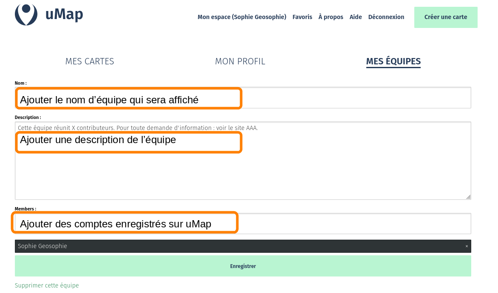
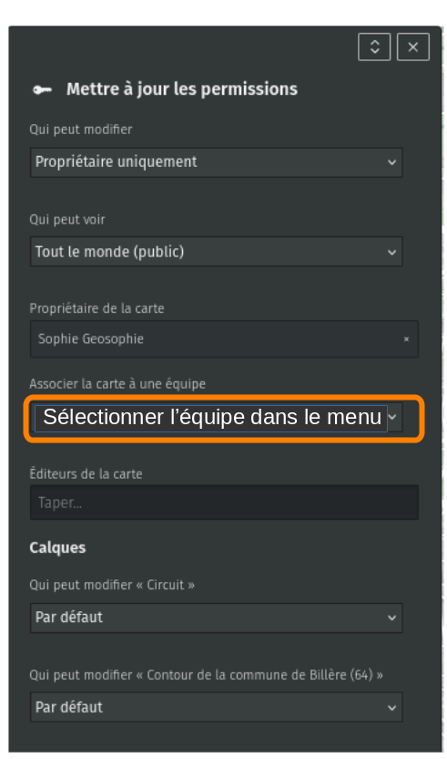

!!! abstract "Ce que nous allons apprendre"

    - utiliser un compte pour retrouver ses cartes
    - créer une équipe
    - partager une carte avec une équipe

## Procédons par étapes

Nous avons appris dans [le tutoriel précédent](2-first-map.md) comment créer une
carte anonyme contenant un marqueur. Nous allons à présent créer un compte et une équipe.

Nota : il n’y a pas de carte anonyme sur
[l’instance uMap pour les agents publics](https://umap.incubateur.anct.gouv.fr/fr/).

Au lieu de créer une carte anonyme, nous allons utiliser un compte pour
créer cette carte.

### 1. Utiliser un compte

**uMap** permet d’associer ses cartes à un compte. Cela présente plusieurs
avantages importants par rapport à la création de cartes anonymes :

-   les cartes créées avec un compte constituent un catalogue permettant
    d’accéder facilement à ses cartes
-   on peut modifier chaque carte du catalogue sans avoir besoin de
    conserver un lien d’édition
-   on peut gérer ses cartes en équipe et afficher le nom de l’équipe comme auteur
-   pour les agents publics sur uMap ANCT : une fois connecté avec MonComptePro, on peut utiliser d’autres outils en association avec uMap, comme Grist.

Le logiciel umap ne gère pas directement de comptes utilisateurs : la
gestion des comptes dépend de la configuration du logiciel.

#### Pour le grand public, les associations…

Sur <https://umap.openstreetmap.fr>, vous pouvez utiliser un compte que vous
avez ouvert sur un site Web au choix : OpenStreetMap, Github,
ou Bitbucket. Si vous n’avez aucun compte sur ces outils, c’est le
moment de vous inscrire sur le site www.openstreetmap.org : cliquez
**Créer un compte** dans le coin supérieur droit et suivez les
instructions - une adresse mail vous sera demandée ([plus
d’infos](https://openstreetmap.fr/inscription-openstreetmap)).

Cliquez sur **Connexion /
Créer un compte** puis sur le pictogramme correspondant au compte que
vous souhaitez utiliser. Apparaît alors la page de connexion du site :
saisissez le nom d’utilisateur et le mot de passe. La page suivante vous
demande d’autoriser l’application uMap à utiliser ce compte : accordez
cet accès. Vous retrouvez alors la page d’accueil de uMap, sur laquelle
le lien de connexion a laissé la place à un lien **Mes cartes** vous
permettant d’accéder à l’ensemble des cartes créées avec ce compte.

Notez l’URL de la barre d’adresse quand vous consultez votre catalogue
de cartes : celle-ci contient le nom de votre compte - par exemple
<https://umap.openstreetmap.fr/fr/user/cartocite/>. Vous pouvez
l’utiliser pour accéder à votre catalogue de cartes, même sans être
connecté à votre compte : vous pouvez diffuser cette URL, les
récipiendaires ne pourront pas modifier vos cartes.

#### :fontawesome-solid-landmark-flag: Pour les agents publics

1. Se connectez à MonComptePro : <https://moncomptepro.beta.gouv.fr/>  
   Toute personne qui travaille pour un service public y a accès.
2. Créez un compte sur MonComptePro. L’opération prend quelques minutes.
3. Sur [le site uMap pour les agents publics](https://umap.incubateur.anct.gouv.fr/fr/),
   cliquez sur `Me Connecter`.

Le tableau de bord s’ouvre, il affiche l’ensemble des cartes que
vous créez ainsi que les équipes auxquelles vous participez.

!!! french-instance "Pour les agents publics"
    Associer une carte à une équipe vous permet d’afficher le nom de cette équipe au lieu du vôtre sur une carte (noms de votre commune, de votre service,…). Une équipe peut se composer d’une seule personne.

### 2. Créer une équipe

Une fois connecté sur l’instance uMap,
cliquer sur « Mon espace », puis « Mes équipes » :

Puis sur « Nouvelle équipe » et renseigner les informations

Lorsqu’un nouvel utilisateur est associé à une équipe,
il voit l’équipe s’afficher sur son tableau de bord,
il accède à toutes les cartes qui sont partagées et il peut les modifier.

!!! note
    Tous les membres d’une équipe partagent les mêmes droits d’édition sur une carte
    qui est associée à une équipe. Une équipe peut être supprimée,
    ou son nom modifié en un simple clic.

### 3. Partager une carte avec une équipe

Une fois l’équipe créée, il reste encore à donner les droits de modification
d’une carte à ses membres. Pour ce faire : ouvrez la carte,
puis sur cliquez sur « Editer » et cliquez en haut de page
à droite du titre sur « Visibilité : Définir qui peut voir et modifier la carte ».

